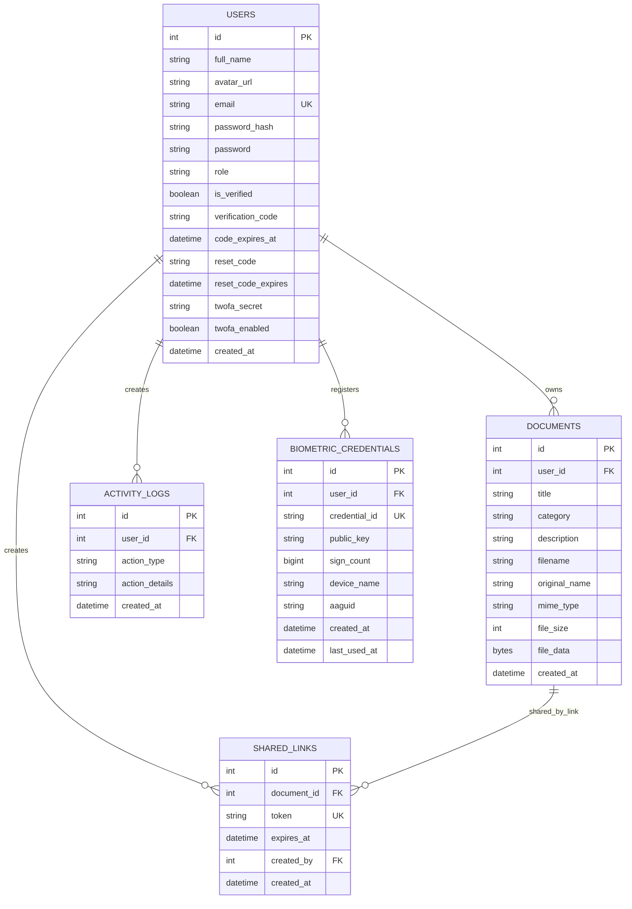

# AuthGuard Locker ERD

Бұл диаграмма мен schema notes осы жобаның қазіргі `frontend` + `backend` кодына сәйкестендірілген.

## 1. Runtime model

Frontend-тегі негізгі flow-лар:

- `Login / Register / Forgot password` -> `users`
- `Dashboard / Profile / 2FA settings` -> `users`, `activity_logs`
- `MyDocuments / AddDocument / Viewer / SharedDocument` -> `documents`, `shared_links`
- `BiometricSettings` -> `biometric_credentials`
- `AdminPanel` -> `users`, `documents`, `activity_logs`, `shared_links`

Backend-тегі негізгі persistence entity-лер:

- `users`
- `documents`
- `shared_links`
- `activity_logs`
- `biometric_credentials`

## 2. Accurate ERD



## 3. Important code-alignment notes

Бұл жобаға қатысты маңызды нюанстар:

- `users.password_hash` негізгі қолданылатын баған.
- `users.password` legacy/fallback ретінде кодта әлі бар, әсіресе `2fa/reset-login` flow ішінде.
- `documents.file_data` тек Postgres database-storage режимінде қолданылады.
- `documents.filename` filesystem-storage режимінде де, database-storage режимінде де толтырылады.
- `documents.secret_content` қолданылмайды және cleanup кезінде өшірілуі керек.
- `shared_links.created_by` логикалық түрде `users.id`-ге сілтейді.
- `activity_logs.user_id` nullable болуы мүмкін, бірақ код әдетте user бар кезде жазады.
- `biometric_credentials` passkey/WebAuthn үшін қолданылады.

## 4. Recommended SQL Server schema

Төмендегі SQL script-ті SQL Server-ге салсаң, ол қазіргі backend кодына сай structure береді.

```sql
IF OBJECT_ID('users', 'U') IS NULL
BEGIN
  CREATE TABLE users (
    id INT IDENTITY(1,1) PRIMARY KEY,
    full_name NVARCHAR(255) NULL,
    avatar_url NVARCHAR(MAX) NULL,
    email NVARCHAR(255) NOT NULL UNIQUE,
    password_hash NVARCHAR(500) NULL,
    password NVARCHAR(500) NULL,
    role NVARCHAR(50) NOT NULL DEFAULT 'user',
    is_verified BIT NOT NULL DEFAULT 0,
    verification_code NVARCHAR(10) NULL,
    code_expires_at DATETIME NULL,
    reset_code NVARCHAR(10) NULL,
    reset_code_expires DATETIME NULL,
    twofa_secret NVARCHAR(255) NULL,
    twofa_enabled BIT NOT NULL DEFAULT 0,
    created_at DATETIME NOT NULL DEFAULT GETDATE()
  );
END;

IF OBJECT_ID('documents', 'U') IS NULL
BEGIN
  CREATE TABLE documents (
    id INT IDENTITY(1,1) PRIMARY KEY,
    user_id INT NULL,
    title NVARCHAR(255) NOT NULL,
    category NVARCHAR(255) NOT NULL,
    description NVARCHAR(MAX) NULL,
    filename NVARCHAR(500) NOT NULL,
    original_name NVARCHAR(500) NULL,
    mime_type NVARCHAR(255) NULL,
    file_size INT NULL,
    file_data VARBINARY(MAX) NULL,
    created_at DATETIME NOT NULL DEFAULT GETDATE(),
    CONSTRAINT FK_documents_users
      FOREIGN KEY (user_id) REFERENCES users(id) ON DELETE CASCADE
  );
END;

IF OBJECT_ID('shared_links', 'U') IS NULL
BEGIN
  CREATE TABLE shared_links (
    id INT IDENTITY(1,1) PRIMARY KEY,
    document_id INT NOT NULL,
    token NVARCHAR(255) NOT NULL UNIQUE,
    expires_at DATETIME NOT NULL,
    created_by INT NULL,
    created_at DATETIME NOT NULL DEFAULT GETDATE(),
    CONSTRAINT FK_shared_links_documents
      FOREIGN KEY (document_id) REFERENCES documents(id) ON DELETE CASCADE,
    CONSTRAINT FK_shared_links_users
      FOREIGN KEY (created_by) REFERENCES users(id)
  );
END;

IF OBJECT_ID('activity_logs', 'U') IS NULL
BEGIN
  CREATE TABLE activity_logs (
    id INT IDENTITY(1,1) PRIMARY KEY,
    user_id INT NULL,
    action_type NVARCHAR(100) NULL,
    action_details NVARCHAR(MAX) NULL,
    created_at DATETIME NOT NULL DEFAULT GETDATE(),
    CONSTRAINT FK_activity_logs_users
      FOREIGN KEY (user_id) REFERENCES users(id) ON DELETE SET NULL
  );
END;

IF OBJECT_ID('biometric_credentials', 'U') IS NULL
BEGIN
  CREATE TABLE biometric_credentials (
    id INT IDENTITY(1,1) PRIMARY KEY,
    user_id INT NOT NULL,
    credential_id NVARCHAR(500) NOT NULL UNIQUE,
    public_key NVARCHAR(MAX) NOT NULL,
    sign_count BIGINT NOT NULL DEFAULT 0,
    device_name NVARCHAR(255) NULL,
    aaguid NVARCHAR(255) NULL,
    created_at DATETIME NOT NULL DEFAULT GETDATE(),
    last_used_at DATETIME NOT NULL DEFAULT GETDATE(),
    CONSTRAINT FK_biometric_credentials_users
      FOREIGN KEY (user_id) REFERENCES users(id) ON DELETE CASCADE
  );
END;
```

## 5. Recommended PostgreSQL schema

Егер project Postgres-пен жүрсе, мына DDL backend logic-пен дәл келеді:

```sql
CREATE TABLE IF NOT EXISTS users (
  id SERIAL PRIMARY KEY,
  full_name VARCHAR(255),
  avatar_url TEXT,
  email VARCHAR(255) UNIQUE NOT NULL,
  password_hash VARCHAR(500),
  password VARCHAR(500),
  role VARCHAR(50) DEFAULT 'user',
  is_verified BOOLEAN DEFAULT FALSE,
  verification_code VARCHAR(10),
  code_expires_at TIMESTAMPTZ,
  reset_code VARCHAR(10),
  reset_code_expires TIMESTAMPTZ,
  twofa_secret VARCHAR(255),
  twofa_enabled BOOLEAN DEFAULT FALSE,
  created_at TIMESTAMPTZ DEFAULT NOW()
);

CREATE TABLE IF NOT EXISTS documents (
  id SERIAL PRIMARY KEY,
  user_id INTEGER REFERENCES users(id) ON DELETE CASCADE,
  title VARCHAR(255) NOT NULL,
  category VARCHAR(255) NOT NULL,
  description TEXT,
  filename VARCHAR(500) NOT NULL,
  original_name VARCHAR(500),
  mime_type VARCHAR(255),
  file_size INTEGER,
  file_data BYTEA,
  created_at TIMESTAMPTZ DEFAULT NOW()
);

CREATE TABLE IF NOT EXISTS shared_links (
  id SERIAL PRIMARY KEY,
  document_id INTEGER NOT NULL REFERENCES documents(id) ON DELETE CASCADE,
  token VARCHAR(255) UNIQUE NOT NULL,
  expires_at TIMESTAMPTZ NOT NULL,
  created_by INTEGER REFERENCES users(id),
  created_at TIMESTAMPTZ DEFAULT NOW()
);

CREATE TABLE IF NOT EXISTS activity_logs (
  id SERIAL PRIMARY KEY,
  user_id INTEGER REFERENCES users(id) ON DELETE SET NULL,
  action_type VARCHAR(100),
  action_details TEXT,
  created_at TIMESTAMPTZ DEFAULT NOW()
);

CREATE TABLE IF NOT EXISTS biometric_credentials (
  id SERIAL PRIMARY KEY,
  user_id INTEGER NOT NULL REFERENCES users(id) ON DELETE CASCADE,
  credential_id VARCHAR(500) UNIQUE NOT NULL,
  public_key TEXT NOT NULL,
  sign_count BIGINT DEFAULT 0,
  device_name VARCHAR(255),
  aaguid VARCHAR(255),
  created_at TIMESTAMPTZ DEFAULT NOW(),
  last_used_at TIMESTAMPTZ DEFAULT NOW()
);
```

## 6. Schema extraction queries

### SQL Server: columns

```sql
SELECT
  t.name AS table_name,
  c.column_id,
  c.name AS column_name,
  ty.name AS data_type,
  c.max_length,
  c.is_nullable
FROM sys.tables t
JOIN sys.columns c ON t.object_id = c.object_id
JOIN sys.types ty ON c.user_type_id = ty.user_type_id
ORDER BY t.name, c.column_id;
```

### SQL Server: foreign keys

```sql
SELECT
  fk.name AS fk_name,
  tp.name AS parent_table,
  cp.name AS parent_column,
  tr.name AS referenced_table,
  cr.name AS referenced_column
FROM sys.foreign_keys fk
JOIN sys.foreign_key_columns fkc
  ON fk.object_id = fkc.constraint_object_id
JOIN sys.tables tp
  ON fkc.parent_object_id = tp.object_id
JOIN sys.columns cp
  ON fkc.parent_object_id = cp.object_id
 AND fkc.parent_column_id = cp.column_id
JOIN sys.tables tr
  ON fkc.referenced_object_id = tr.object_id
JOIN sys.columns cr
  ON fkc.referenced_object_id = cr.object_id
 AND fkc.referenced_column_id = cr.column_id
ORDER BY tp.name, fk.name;
```

### PostgreSQL: columns

```sql
SELECT
  table_name,
  ordinal_position,
  column_name,
  data_type,
  is_nullable
FROM information_schema.columns
WHERE table_schema = 'public'
ORDER BY table_name, ordinal_position;
```

### PostgreSQL: foreign keys

```sql
SELECT
  tc.table_name,
  kcu.column_name,
  ccu.table_name AS foreign_table_name,
  ccu.column_name AS foreign_column_name
FROM information_schema.table_constraints tc
JOIN information_schema.key_column_usage kcu
  ON tc.constraint_name = kcu.constraint_name
JOIN information_schema.constraint_column_usage ccu
  ON ccu.constraint_name = tc.constraint_name
WHERE tc.constraint_type = 'FOREIGN KEY'
ORDER BY tc.table_name, kcu.column_name;
```
